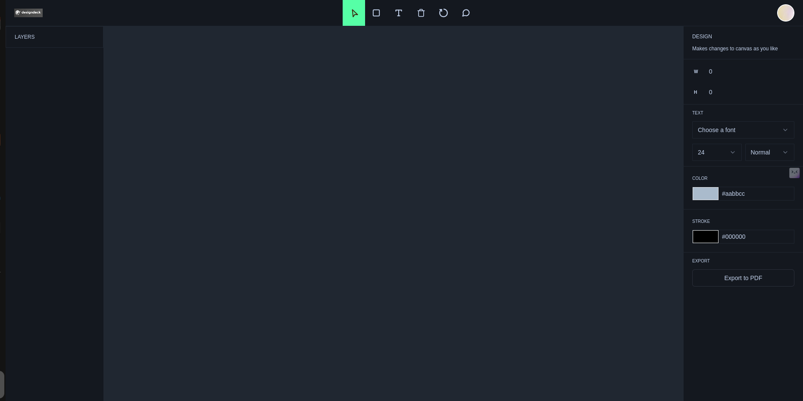

# DesignDeck



DesignDeck is a web-based collaborative design tool similar to Figma, built using Next.js, TypeScript, Tailwind CSS, and LiveBlocks API, Fabric.js. With Designdeck, teams can seamlessly collaborate on designing interfaces in real-time with a plethora of features.

## Table of Contents

- [Demo](#demo)
- [Features](#features)
- [Technologies Used](#technologies-used)
- [Environment Variables](#environment-variables)
- [Getting Started](#getting-started)
- [Folder Structure](#folder-structure)
- [Running the Application](#running-the-application)
- [Documentation](#documentation)

## Demo

You can see a live demo of the portfolio website at [https://design-deck.vercel.app/]

## Features

| Feature               | Description                                                                                               |
|----------------------|-----------------------------------------------------------------------------------------------------------|
| **Live Collaboration** | Multiple users can simultaneously work on the canvas with live updates of cursor positions and changes. |
| **Shape Manipulation** | Add, modify, and delete shapes. Customize properties like width, height, stroke color, and more.        |
| **Free Drawing**      | Utilize the pencil feature to free draw on the canvas.                                                  |
| **Text Addition**     | Add text to designs and adjust font size, weight, and style.                                            |
| **Copy and Paste**    | Easily duplicate elements on the canvas.                                                                 |
| **Comment Threads**   | Add comments to specific elements and reply to them.                                                    |
| **Real-Time Updates** | Instant updates for all users in real-time.                                                              |
| **Undo/Redo**        | Easily undo or redo actions using keyboard shortcuts (Ctrl+Z and Ctrl+Y).                               |
| **Chat Bubbles**     | Quick communication among team members through chat bubbles.                                              |
| **Reactions**        | Express reactions to designs using keyboard shortcuts.                                                   |
| **Export to PDF**    | Export selected elements on the canvas to PDF format.                                                   |


## Technologies Used

- **Next.js**: For server-side rendering and routing.
- **TypeScript**: To add static types to JavaScript.
- **Tailwind CSS**: Utility-first CSS framework for styling.
- **LiveBlocks API**: Real-time collaboration API for syncing data across clients.
- **Fabric.js**: HTML5 canvas library for manipulating graphics and interactive content.
- **Shadcn**: Component library for UI elements.


## Environment Variables

The project relies on environment variables stored in a `.env.local` file located at the root of the `Designdeck` directory to manage configurations. Ensure that essential variables such as database connection strings, API keys, or any other sensitive information are properly set up.

```bash
NEXT_PUBLIC_LIVEBLOCKS_PUBLIC_KEY = "*YOUR LIVEBLOCKS API PUBLIC KEY*"
```

Be sure to replace `*YOUR LIVEBLOCKS API PUBLIC KEY*` with your actual LiveBlocks API public key to enable proper integration.

**Note**: Note: Replace `YOUR LIVEBLOCKS API PUBLIC KEY` with your actual key. Sensitive information should not be committed to version control; include the .env files in your project's `gitignore.`

### Getting started

1. Clone this repository to your local machine:

```bash
git clone https://github.com/jahnvisahni31/Designdeck.git
```

2. Change to the project directory:

```bash
cd Designdeck
```

3. Install and run client dependencies:

```bash
npm install
npm run dev
```

Open your web browser and visit http://localhost:3000 to see the website in action during development.

## Folder Structure

```
Designdeck/
├── app/                # Next.js pages
├── components/         # React components
├── constants/          # Constants or configurations
├── hooks/              # Custom hooks
├── lib/                # Utility functions or external libraries
└── public/             # Public assets
```

## Running the Application

1. Start the development server: `npm run dev`
2. Open your browser and navigate to `http://localhost:3000`

## Documentation

- **[Next.js Documentation](https://nextjs.org/docs/getting-started)**: Learn more about Next.js for server-side rendering and routing.
- **[TypeScript Documentation](https://www.typescriptlang.org/docs/)**: Explore TypeScript documentation for adding static types to JavaScript.
- **[Tailwind CSS Documentation](https://tailwindcss.com/docs)**: Dive into Tailwind CSS documentation for utility-first CSS styling.
- **[LiveBlocks API Documentation](https://liveblocks.io/docs/)**: Refer to LiveBlocks API documentation for real-time collaboration.
- **[Fabric.js Documentation](http://fabricjs.com/docs/)**: Discover Fabric.js documentation for HTML5 canvas manipulation.
- **[Shadcn Documentation](https://ui.shadcn.com/docs)**: Comprehensive documentation for the Shadcn component library, offering a wide range of customizable UI components to enhance your web application's user interface.

This section provides links to the documentation pages of the technologies used in the project for further exploration and learning.

---

Feel free to adjust any sections or details according to your preferences!
